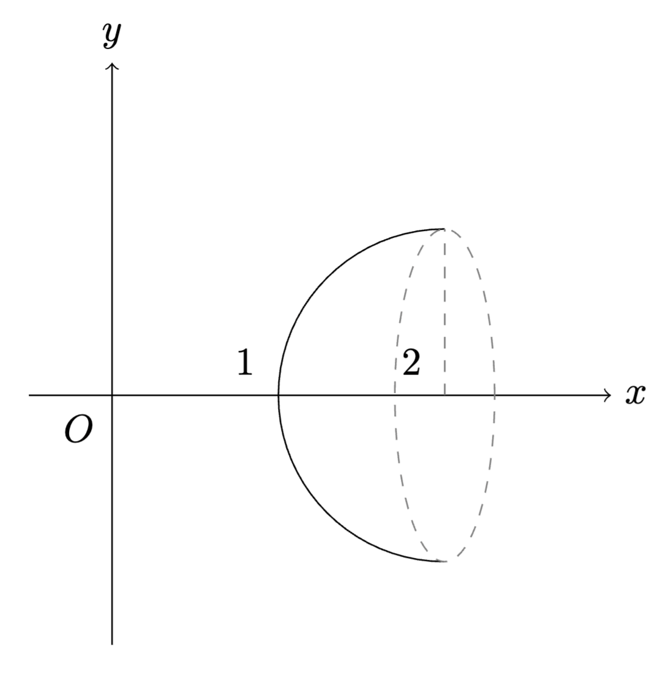

# 北京大学 22/23 学年第 1 学期

# 高数 B 期中试题答案

原文链接：<a href="https://mp.weixin.qq.com/s/qVzlyIhIViyJZ5dCygX-Bg">数竞之捷</a>。由 Arthals 校对。如有问题请查阅原文。

1.  $$
    \lim_{n\to\infty}(1+\frac1{ne})^n\overset{t=ne}{\operatorname*{=}}\lim_{t\to+\infty}(1+\frac1t)^{t\cdot\frac1{e}}=\mathrm{e}^{\frac1{e}}.
    $$

2.  对于任意 $x > 0$，存在 $n \in \mathbb{N}_+$，使得 $n \leq x < n+1$，此时有 $[x] = n$。

    因此，有：

    $$
    n \sin \frac{1}{[x]} \leq x \sin \frac{1}{[x]} < (n+1) \sin \frac{1}{n}.
    $$

    从而：

    $$
    \lim_{n \to \infty} n \sin t \leq \lim_{x \to +\infty} x \sin \frac{1}{[x]} \leq \lim_{n \to \infty} (n+1) \sin \frac{1}{n}.
    $$

    令 $\frac{1}{n} = t$，则有：

    $$
    \lim_{t \to 0^+} \frac{\sin t}{t} \leq \lim_{x \to +\infty} x \sin \frac{1}{[x]} \leq \lim_{t \to 0^+} (t+1) \cdot \frac{\sin t}{t}.
    $$

    即，

    $$
    1 \leq \lim_{x \to +\infty} x \sin \frac{1}{[x]} \leq 1.
    $$

    由夹逼定理可得：

    $$
    \lim_{x \to +\infty} x \sin \frac{1}{[x]} = 1.
    $$

3.  由变上限积分函数的性质和链式法则得

    $$
    f'(x) = \sqrt{1 + e^{\ln x}}(\ln x)' = \frac{\sqrt{1 + x}}{x}.
    $$

4.  有理式分拆得

    $$
    P = \frac{4x^2 + 4x - 11}{(2x - 1)(2x + 3)(2x - 5)} = \frac{a}{2x - 1} + \frac{b}{2x + 3} + \frac{c}{2x - 5},
    $$

    将右侧通分，则分子满足

    $$
    4x^2 + 4x - 11 = a(2x + 3)(2x - 5) + b(2x - 1)(2x - 5) + c(2x - 1)(2x + 3).
    $$

    令

    $$
    x = \frac{1}{2}, 得 a = \frac{1}{2}; 令 x = -\frac{3}{2}, 得 b = -\frac{1}{4}; 令 x = \frac{1}{2}, 得 c = \frac{3}{4}.
    $$

    于是，

    $$
    P = \frac{1}{2} \cdot \frac{1}{2x - 1} - \frac{1}{4} \cdot \frac{1}{2x + 3} + \frac{3}{4} \cdot \frac{1}{2x - 5}.
    $$

    从而，

    $$
    \begin{aligned}
    &\int \frac{4x^2 + 4x - 11}{(2x - 1)(2x + 3)(x - 5)} \, \mathrm{d}x \\

    &= \frac{1}{2} \int \frac{\mathrm{d}x}{2x - 1} - 4 \int \frac{\mathrm{d}x}{2x + 3} + \frac{3}{4} \int \frac{\mathrm{d}x}{2x - 5}\\

    &= \frac{1}{8} \ln \left| \frac{(2x - 1)^2 (2x - 5)^3}{2x + 3} \right| + C.
    \end{aligned}
    $$

    方法二：待定系数法

    $$
    \begin{aligned}
    &4x^2 + 4x - 11\\

    &= (4a + 4b + 4c)x^2 - (4a + 12b - 4c)x + (-15a + 5b - 3c).
    \end{aligned}
    $$

    由待定系数法，

    $$
    \begin{cases}
    4a + 4b + 4c = 4 \\
    -4a - 12b + 4c = 4 \\
    -15a + 5b - 3c = -11
    \end{cases}
    $$

    解得

    $$
    \begin{cases}
    a = \frac{1}{2} \\
    b = -\frac{1}{4} \\
    c = \frac{3}{4}
    \end{cases}
    $$

    余下同上.

5.  $$
    y'=\frac12(\sqrt{x^2-1}+\frac{x^2}{\sqrt{x^2-1}}-\frac{1+\frac x{\sqrt{x^2-1}}}{x+\sqrt{x^2-1}})=\sqrt{x^2-1}\:,
    $$

    所求弧长

    $$
    L = \int_{1}^{2} \sqrt{1+y'^2} \, \mathrm{d}x = \int_{1}^{2} x \, \mathrm{d}x = \left. \frac{1}{2} x^2 \right|_{1}^{2} = \frac{3}{2}.
    $$

6.  $$
    y = \frac{\ln x}{\sqrt{2\pi}} \quad (1 \leq x \leq 2)
    $$

    

    $$
    \begin{aligned}
    V =& \pi \int_{1}^{2} y^2 \, \mathrm{d}x = \frac{1}{2} \int_{1}^{2} \ln^2 x \, \mathrm{d}x = \left. \frac{1}{2} x \ln^2 x \right|_{1}^{2} - \frac{1}{2} \int_{1}^{2} x \, \mathrm{d}(\ln^2 x)\\
    
    =& (\ln 2)^2 - \int_{1}^{2} \ln x \, \mathrm{d}x = (\ln 2)^2 -\left. x \ln x \right|_{1}^{2} + \int_{1}^{2} x \, \mathrm{d}(\ln x)\\
    
    =& (\ln 2)^2 - 2 \ln 2 + 1 = (\ln 2 - 1)^2.
    \end{aligned}
    $$

7.  一方面，$a_1 > b_1 > 0$，故

    $$
    a_2 = \frac{a_1 + b_1}{2} > \sqrt{a_1 b_1} = b_2 > 0
    $$

    于是归纳地，$a_n > b_n > 0$.

    另一方面，

    $$
    a_{n+1} = \frac{a_n + b_n}{2} < \frac{a_n + a_n}{2} = a_n
    $$

    故 $\{a_n\}$ 单调递减.

    综上，序列 $\{a_n\}$ 单调有界，故

    $$
    \lim_{n \to \infty} a_n
    $$

    存在有限.

8.  1. 证明：

        令 $g(x) = \frac{4 \sin x}{3 + \sin^2 x}, x \in \left( -\frac{\pi}{2}, \frac{\pi}{2} \right)$,

        则 $g'(x) = \frac{4 \cos x \left( 3 - \sin^2 x \right)}{\left( 3 + \sin^2 x \right)^2} > 0$, 故 $g(x)$ 在 $\left( -\frac{\pi}{2}, \frac{\pi}{2} \right)$ 上单调递增, 从而 $g \left( -\frac{\pi}{2} \right) < g(x) < g \left( \frac{\pi}{2} \right)$, 即 $-1 < \frac{4 \sin x}{3 + \sin^2 x} < 1$;

    2.  $$
        \begin{aligned}
        f'(x) =& \frac{1}{\sqrt{1 - g^2(x)}} \cdot g'(x)\\
        =& \frac{1}{\sqrt{1 - \left( \frac{4 \sin x}{3 + \sin^2 x} \right)^2}} \cdot \frac{4 \cos x \left( 3 - \sin^2 x \right)}{\left( 3 + \sin^2 x \right)^2}\\
        =& \frac{4 \cos x \left( 3 - \sin^2 x \right)}{\left( 3 + \sin^2 x \right) \sqrt{9 - 10 \sin^2 x + \sin^4 x}}\\
        =& \frac{4 \cos x \left( 3 - \sin^2 x \right)}{\sqrt{1 - \sin^2 x} \sqrt{ 9 - \sin^2 x} \left( 3 + \sin^2 x \right)}\\
        =& \frac{4 \left( 3 - \sin^2 x \right)}{\sqrt{9 - \sin^2 x} \left( 3 + \sin^2 x \right)}
        \end{aligned}
        $$

    3. 证明：

        当 $x \in [0, \frac{\pi}{2}]$, 令 $f(x) = \theta$, $[0, \frac{\pi}{2}]$, 则 $\sin \theta = \frac{4 \sin x}{3 + \sin^2 x}$,

        $$
        \mathrm{d} \theta = f'(x) \mathrm{d} x = \frac{4(3 - \sin x)}{\sqrt{9 - \sin^2 x} (3 + \sin^2 x)} \mathrm{d} x,
        $$

        $$
        \sin^2 \theta = \frac{16 \sin^2 x}{(3 + \sin^2 x)^2}, \cos^2 \theta = \frac{9 - 10 \sin^2 x + \sin^4 x}{(3 + \sin^2 x)^2},
        $$

        故

        $$
        \sqrt{4 \cos^2 \theta + \sin^2 \theta} = \sqrt{\frac{4(3 - \sin^2 x)^2}{(3 + \sin^2 x)^2}} = \frac{2(3 - \sin^2 x)}{3 + \sin^2 x},
        $$

        从而

        $$
        \begin{aligned}
        &\int_{0}^{\frac{\pi}{2}} \frac{\mathrm{d} \theta}{\sqrt{4 \cos^2 \theta + \sin^2 \theta}}\\
        &= \int_{0}^{\frac{\pi}{2}} \frac{4 (3 - \sin^2 x)}{\sqrt{9 - \sin^2 x} (3 + \sin^2 x)} \frac{3 + \sin^2 x}{2 (3 - \sin^2 x)} \mathrm{d} x\\
        &= \int_{0}^{\frac{\pi}{2}} \frac{2 \mathrm{d} x}{\sqrt{9 - \sin^2 x}} = \int_{0}^{\frac{\pi}{2}} \frac{\mathrm{d} x}{\sqrt{\frac{9}{4} \cos^2 x + 2 \sin^2 x}},
        \end{aligned}
        $$

        于是，

        $$
        \int_{0}^{\frac{\pi}{2}} \frac{\mathrm{d} x}{\sqrt{4 \cos^2 x + \sin^2 x}} = \int_{0}^{\frac{\pi}{2}} \frac{\mathrm{d} x}{\sqrt{\frac{9}{4} \cos^2 x + 2 \sin^2 x}}.
        $$

9.  设 $h(x) = f(x) - g(x), x \in [0,1]$，依题意 $h(x)$ 在 $[0,1]$ 上连续。

    因为 $\cos f(1) = \cos g(1)$，$\sin f(1) = \sin g(1)$，所以 $\sin(h(1)) = 0$，从而 $h(1) = 2m\pi, m \in \mathbb{Z}$ ①。

    又

    $$
    \forall x \in [0,1], [\cos f(x) + \cos g(x)]^2 + [\sin f(x) + \sin g(x)]^2 = 2[1 + \cos h(x)] \neq 0,
    $$

    所以 $\forall x \in [0,1], h(x) \neq (2n+1)\pi, n \in \mathbb{Z}$ ②。

    在 ① 中，假设 $m > 0$，则 $h(0) = 0, h(1) = 2m\pi$，由介值定理知：

    $$
    \exists \xi_1 \in [0,1], h(\xi_1) = (2m-1)\pi,
    $$

    这与 ② 矛盾（此时 $n = m-1$）。

    假设 $m < 0$，同理 $\exists \xi_2 \in [0,1], h(\xi_2) = (2m+1)\pi$ 与 ② 矛盾（此时 $n = m$），所以 $m = 0$。即 $f(1) = g(1)$。
