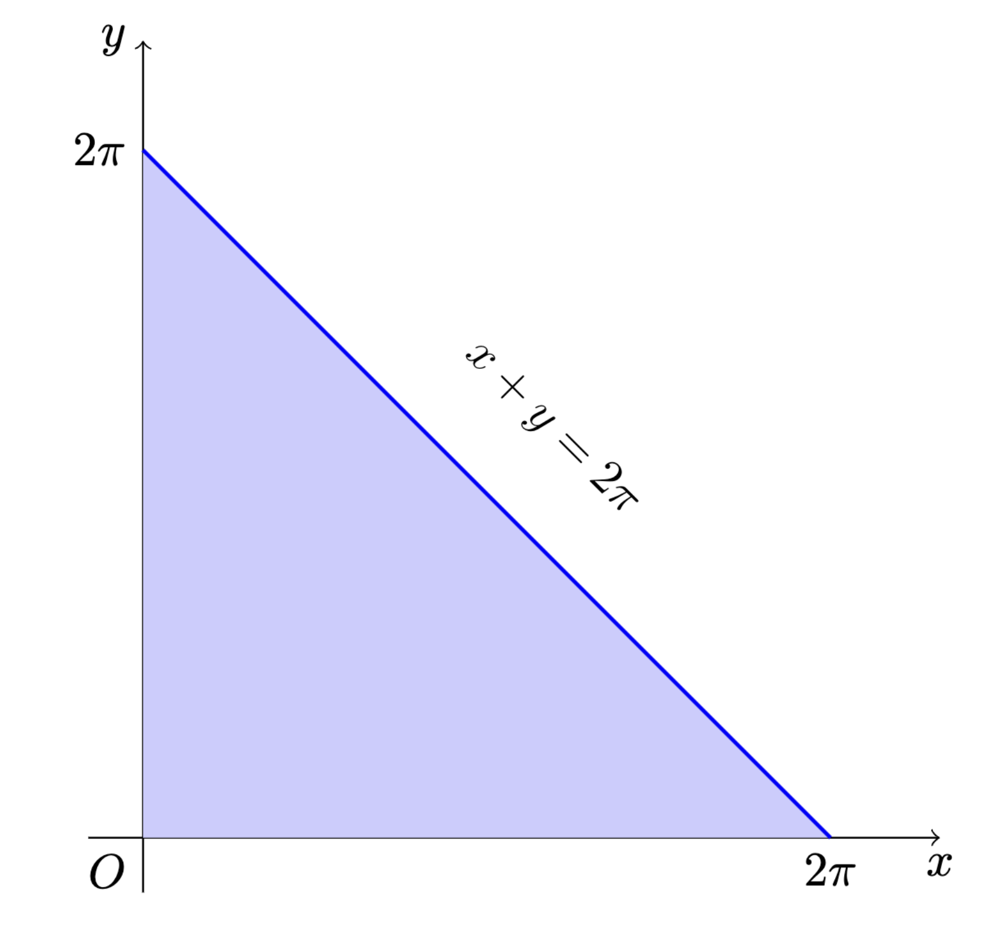

# 北京大学 22/23 学年第 1 学期

# 高数 B 期末试题答案

by Lg_Cat / Arthals

1.  求极限
    $$
    \begin{aligned}
    & \quad \lim_{x \to 0} \frac{\sin(x - \int_0^x \sqrt{1+t^2} \, \mathrm{d}t)}{x^3} \\
    & = \lim_{x \to 0} \frac{x - \int_0^x \sqrt{1+t^2} \, \mathrm{d}t}{x^3} && (\text{当 } u \to 0 \text{ 时, } \sin u \sim u) \\
    & = \lim_{x \to 0} \frac{\frac{\mathrm{d}}{\mathrm{d}x} (x - \int_0^x \sqrt{1+t^2} \, \mathrm{d}t)}{\frac{\mathrm{d}}{\mathrm{d}x} (x^3)} && (\text{洛必达法则, } \frac{0}{0} \text{ 型}) \\
    & = \lim_{x \to 0} \frac{1 - \sqrt{1+x^2}}{3x^2} && (\text{应用牛顿-莱布尼茨公式}) \\
    & = \lim_{x \to 0} \frac{(1 - \sqrt{1+x^2})(1 + \sqrt{1+x^2})}{3x^2(1 + \sqrt{1+x^2})} && (\text{分子有理化}) \\
    & = \lim_{x \to 0} \frac{1 - (1+x^2)}{3x^2(1 + \sqrt{1+x^2})} \\
    & = \lim_{x \to 0} \frac{-x^2}{3x^2(1 + \sqrt{1+x^2})} \\
    & = \lim_{x \to 0} \frac{-1}{3(1 + \sqrt{1+x^2})} && (\text{消去公因子 } x^2) \\
    & = \frac{-1}{3(1 + \sqrt{1+0^2})} \\
    & = -\frac{1}{6}
    \end{aligned}
    $$

2.  求函数的最长严格单调区间

    对于函数 $f(x) = x^3 - 6x^2 + 9x - 1$，$x \in [0, 7]$。

    其导数为：
    $$
    f'(x) = 3x^2 - 12x + 9 = 3(x-1)(x-3)
    $$
    令 $f'(x)=0$ 得驻点 $x=1, x=3$。

    在定义域 $[0, 7]$ 内的严格单调区间为：

    *   $[0, 1]$：$f'(x) > 0$，递增，长度为 $1$。
    *   $[1, 3]$：$f'(x) < 0$，递减，长度为 $2$。
    *   $[3, 7]$：$f'(x) > 0$，递增，长度为 $4$。

    因此，长度为最大的严格单调区间是 $[3, 7]$。

3.  解析几何

    1.  求三角形 $\triangle ABC$ 的面积

        首先，求平面 $2x - y + 3z = 6$ 与坐标轴的交点：

        1. $x$ 轴（$y=0, z=0$）：$2x=6 \implies x=3$。交点 $A(3,0,0)$。
        2. $y$ 轴（$x=0, z=0$）：$-y=6 \implies y=-6$。交点 $B(0,-6,0)$。
        3. $z$ 轴（$x=0, y=0$）：$3z=6 \implies z=2$。交点 $C(0,0,2)$。

        构造向量 $\vec{AB}$ 和 $\vec{AC}$：
        $$
        \vec{AB} = B - A = (-3, -6, 0) \\
        \vec{AC} = C - A = (-3, 0, 2)
        $$
        三角形面积 $S_{\triangle ABC}$ 是由这两个向量构成的平行四边形面积的一半（叉乘自带一个 $\sin$）：
        $$
        \begin{aligned}
        S_{\triangle ABC} & = \frac{1}{2} |\vec{AB} \times \vec{AC}| \\
        & = \frac{1}{2} |(-3, -6, 0) \times (-3, 0, 2)| \\
        & = \frac{1}{2} |(-12, 6, -18)| \\
        & = \frac{1}{2} \sqrt{(-12)^2 + 6^2 + (-18)^2} \\
        & = \frac{1}{2} \sqrt{504} = \frac{1}{2} \sqrt{36 \times 14} = 3\sqrt{14}
        \end{aligned}
        $$

    2.  求切点坐标

        以原点为中心的球面与平面 $T$ 相切，切点 $P(x_0, y_0, z_0)$ 到原点的连线 $\vec{OP}$ 必垂直于平面 $T$。

        因此，向量 $\vec{OP}$ 与平面 $T$ 的法向量 $\vec{n}=(2, -1, 3)$ 共线。

        设 $\vec{OP} = t\vec{n}$，即 $(x_0, y_0, z_0) = (2t, -t, 3t)$。

        因为切点 $P$ 在平面 $T$ 上，所以其坐标满足平面方程：
        $$
        2(2t) - (-t) + 3(3t) = 6 \\
        14t = 6 \implies t = \frac{3}{7}
        $$
        将 $t$ 代回，得到切点坐标：
        $$
        P\left(\frac{6}{7}, -\frac{3}{7}, \frac{9}{7}\right)
        $$

4.  多元函数微分

    函数 $z(x,y)$ 在某点下降最快的方向是其负梯度方向 $-\nabla z$。

    首先，确定在点 $(x,y)=(0,2)$ 处的 $z$ 值。将 $x=0, y=2$ 代入方程 $z^3 + ze^x + y = 0$：
    $$
    z^3 + ze^0 + 2 = 0 \implies z^3 + z + 2 = 0 \implies (z + 1)(z^2 - z + 2) = 0
    $$
    由此可知 $z=-1$ 是唯一一个实根。

    接下来，对隐函数方程两边分别关于 $x$ 和 $y$ 求偏导：

    对 $x$ 求导：
    $$
    3z^2 \frac{\partial z}{\partial x} + \frac{\partial z}{\partial x}e^x + ze^x = 0 \implies \frac{\partial z}{\partial x} = -\frac{ze^x}{3z^2+e^x}
    $$
    对 $y$ 求导：
    $$
    3z^2 \frac{\partial z}{\partial y} + \frac{\partial z}{\partial y}e^x + 1 = 0 \implies \frac{\partial z}{\partial y} = -\frac{1}{3z^2+e^x}
    $$
    将点 $(x,y,z)=(0,2,-1)$ 的值代入，计算偏导数：
    $$
    \frac{\partial z}{\partial x}\bigg|_{(0,2)} = -\frac{(-1)e^0}{3(-1)^2+e^0} = \frac{1}{4} \\
    \frac{\partial z}{\partial y}\bigg|_{(0,2)} = -\frac{1}{3(-1)^2+e^0} = -\frac{1}{4}
    $$
    在点 $(0,2)$ 处的梯度为 $\nabla z(0,2) = \left(\frac{1}{4}, -\frac{1}{4}\right)$。

    下降最快的方向为负梯度方向：
    $$
    \vec{v} = -\nabla z(0,2) = \left(-\frac{1}{4}, \frac{1}{4}\right)
    $$
    该方向上的单位向量为：
    $$
    \vec{u} = \frac{\vec{v}}{|\vec{v}|} = \frac{\left(-\frac{1}{4}, \frac{1}{4}\right)}{\sqrt{(-\frac{1}{4})^2 + (\frac{1}{4})^2}} = \frac{\left(-\frac{1}{4}, \frac{1}{4}\right)}{\frac{\sqrt{2}}{4}} = \left(-\frac{\sqrt{2}}{2}, \frac{\sqrt{2}}{2}\right)
    $$

5.  求二元函数 $f(x,y) = x^y$ 在点 $(1,1)$ 的二阶泰勒多项式。

    计算函数至二阶的各偏导数：
    $$
    \begin{alignedat}{2}
    f_x &= yx^{y-1} & f_y &= x^y \ln x \\
    f_{xx} &= y(y-1)x^{y-2} \quad & f_{yy} &= x^y (\ln x)^2 \\
    f_{xy} &= x^{y-1} + yx^{y-1} \ln x & &
    \end{alignedat}
    $$
    计算这些导数在点 $(1,1)$ 的值：
    $$
    \begin{aligned}
    f(1,1) &= 1 & \\
    f_x(1,1) &= 1 & f_y(1,1) &= 0 \\
    f_{xx}(1,1) &= 0 & f_{yy}(1,1) &= 0 \\
    f_{xy}(1,1) &= 1 & &
    \end{aligned}
    $$
    二阶泰勒多项式 $P_2(x,y)$ 的公式为：
    $$
    \begin{aligned}
    P_2(x,y) =& f(1,1) + f_x(1,1)(x-1) + f_y(1,1)(y-1) \\&+ \frac{1}{2!}\left[f_{xx}(1,1)(x-1)^2 + 2f_{xy}(1,1)(x-1)(y-1) + f_{yy}(1,1)(y-1)^2\right]
    \end{aligned}
    $$
    代入计算出的值：
    $$
    \begin{aligned}
    P_2(x,y) &= 1 + 1(x-1) + 0(y-1) + \frac{1}{2}\left[0 \cdot (x-1)^2 + 2 \cdot 1 \cdot (x-1)(y-1) + 0 \cdot (y-1)^2\right] \\
    &= 1 + (x-1) + (x-1)(y-1) \\
    &= 1 + x - 1 + xy - x - y + 1 \\
    &= xy - y + 1
    \end{aligned}
    $$
    所以，所求的二阶泰勒多项式为 $P_2(x,y) = xy - y + 1$。

6.  设 $D$ 是由直线 $x + y = 2 \pi$、$x$ 轴和 $y$ 轴所围成的有界闭区域。求 $D$ 上的二元函数 $f(x, y) = \sin x + \sin y - \sin (x + y)$ 达到最大值的 $D$ 中所有点。

    区域 $D$ 形如：

    

    首先，我们分析函数在区域 $D$ 的边界上的值。

    *   当 $x=0$ 时，$f(0,y) = \sin 0 + \sin y - \sin y = 0$。
    *   当 $y=0$ 时，$f(x,0) = \sin x + \sin 0 - \sin x = 0$。
    *   当 $x+y=2\pi$ 时，$f(x, 2\pi-x) = \sin x + \sin(2\pi-x) - \sin(2\pi) = \sin x - \sin x - 0 = 0$。

    所以，函数在整个边界上恒为 $0$。

    接着，我们寻找 $D$ 内部可能的极值点，即驻点。为此，我们需要计算 $f(x, y)$ 的偏导数，并令它们等于零。

    $$
    \frac{\partial f}{\partial x} = \cos x - \cos(x+y)
    $$

    $$
    \frac{\partial f}{\partial y} = \cos y - \cos(x+y)
    $$

    令偏导数等于零，我们得到方程组：
    $$
    \begin{cases}
    \cos x - \cos(x+y) = 0 \\
    \cos y - \cos(x+y) = 0
    \end{cases}
    $$
    从这个方程组，我们可以立即得出 $\cos x = \cos y = \cos(x+y)$。

    我们先来解 $\cos x = \cos y$。在区域 $D$ 的内部，我们有 $x > 0, y > 0, x+y < 2\pi$。
    在区间 $(0, 2\pi)$ 内，$\cos x = \cos y$ 意味着 $x = y$ 或者 $x = 2\pi - y$。

    1. $x = y$

       将 $x=y$ 代入方程 $\cos x = \cos(x+y)$ 中，得到：
       $$
       \cos x = \cos(2x) \\
       \cos x = 2\cos^2 x - 1 \\
       2\cos^2 x - \cos x - 1 = 0 \\
       (2\cos x + 1)(\cos x - 1) = 0
       $$
       这给出了两种可能：

       1.  $\cos x = 1$。在 $(0, 2\pi)$ 区间内，没有解。如果考虑 $x=0$，则 $y=0$，这是边界点 $(0,0)$，不属于内部。
       2.  $\cos x = -\frac{1}{2}$。在 $(0, 2\pi)$ 区间内，解为 $x = \frac{2\pi}{3}$ 或 $x = \frac{4\pi}{3}$。
           1. 如果 $x = \frac{2\pi}{3}$，因为 $x=y$，所以 $y = \frac{2\pi}{3}$。我们检查这个点 $(\frac{2\pi}{3}, \frac{2\pi}{3})$ 是否在 $D$ 的内部。显然 $x>0, y>0$，并且 $x+y = \frac{2\pi}{3} + \frac{2\pi}{3} = \frac{4\pi}{3} < 2\pi$。所以，$(\frac{2\pi}{3}, \frac{2\pi}{3})$ 是一个内部驻点。
           2. 如果 $x = \frac{4\pi}{3}$，则 $y = \frac{4\pi}{3}$。此时 $x+y = \frac{8\pi}{3} > 2\pi$，这个点不在区域 $D$ 内。

       因此，我们在 $D$ 的内部找到了唯一一个驻点：$(\frac{2\pi}{3}, \frac{2\pi}{3})$。

    2. $x = 2\pi - y$

       这种情况即 $x+y=2\pi$，这正好是区域 $D$ 的一条边界，前文已经讨论。

    现在，我们计算内部驻点处的函数值：
    $$
    \begin{aligned}
    f\left(\frac{2\pi}{3}, \frac{2\pi}{3}\right) &= \sin\left(\frac{2\pi}{3}\right) + \sin\left(\frac{2\pi}{3}\right) - \sin\left(\frac{2\pi}{3} + \frac{2\pi}{3}\right) \\
    &= \frac{\sqrt{3}}{2} + \frac{\sqrt{3}}{2} - \sin\left(\frac{4\pi}{3}\right) \\
    &= \sqrt{3} - \left(-\frac{\sqrt{3}}{2}\right) \\
    &= \frac{3\sqrt{3}}{2}
    \end{aligned}
    $$

    由于 $\frac{3\sqrt{3}}{2} > 0$，且边界值均为 $0$，所以该点为最大值点。

    综上，函数 $f(x, y) = \sin x + \sin y - \sin(x+y)$ 在区域 $D$ 上的最大值为 $\frac{3\sqrt{3}}{2}$，并且这个最大值仅在一点达到。

    达到最大值的点是：
    $$
    \left(\frac{2\pi}{3}, \frac{2\pi}{3}\right)
    $$

7.  1. 偏导数的记号 $\frac{\partial z}{\partial x}$ 不仅表示对第一个变量求导，还隐含了“保持其他变量不变”这一条件。当自变量集合改变时，即使新旧第一个变量相同（如 $x=t$），但需要“保持不变”的“其他变量”却不同了（$y$ vs. $u$），因此求导结果通常也不同。

       设 $z(x, y) = x + \frac{x}{y}$。

       作变量代换 $t = x, u = \frac{x}{y}$，则 $z$ 也可表示为 $z(t, u) = t + u$。

       在 $(x, y)$ 坐标系下，保持 $y$ 不变对 $x$ 求导：
       $$
       \frac{\partial z}{\partial x} = \frac{\partial}{\partial x} \left(x + \frac{x}{y}\right) = 1 + \frac{1}{y}
       $$
       在 $(t, u)$ 坐标系下，保持 $u$ 不变对 $t$ 求导：
       $$
       \frac{\partial z}{\partial t} = \frac{\partial}{\partial t} (t+u) = 1
       $$
       显然，$1 + \frac{1}{y} \ne 1$ (除非 $y \to \infty$)，故 $\frac{\partial z}{\partial x} \ne \frac{\partial z}{\partial t}$。

    2. 我们的目标是证明 $\frac{\partial W}{\partial t} = 0$。

       首先，由 $z = \frac{t}{1 + tW}$，可反解出 $W$：
       $$
       1 + tW = \frac{t}{z} \implies W = \frac{1}{z} - \frac{1}{t}
       $$
       将 $W$ 对 $t$ 求偏导：
       $$
       \frac{\partial W}{\partial t} = \frac{\partial}{\partial t} \left(\frac{1}{z} - \frac{1}{t}\right) = -\frac{1}{z^2}\frac{\partial z}{\partial t} + \frac{1}{t^2} = \frac{t^2 - z^2 \frac{\partial z}{\partial t}}{t^2 z^2}
       $$
       接下来，我们利用链式法则计算 $\frac{\partial z}{\partial t}$。
       $$
       \frac{\partial z}{\partial t} = \frac{\partial z}{\partial x} \frac{\partial x}{\partial t} + \frac{\partial z}{\partial y} \frac{\partial y}{\partial t}
       $$
       根据变量代换关系 $x=t$ 和 $y = \frac{t}{1+tu}$，我们有：
       $$
       \frac{\partial x}{\partial t} = 1, \quad \frac{\partial y}{\partial t} = \frac{(1+tu) - t(u)}{(1+tu)^2} = \frac{1}{(1+tu)^2}
       $$
       代入链式法则表达式：
       $$
       \frac{\partial z}{\partial t} = \frac{\partial z}{\partial x} + \frac{1}{(1+tu)^2}\frac{\partial z}{\partial y}
       $$
       现在，将原方程 $x^2 \frac{\partial z}{\partial x} + y^2 \frac{\partial z}{\partial y} = z^2$ 用新变量 $t, u$ 表示：
       $$
       t^2 \frac{\partial z}{\partial x} + \left(\frac{t}{1+tu}\right)^2 \frac{\partial z}{\partial y} = z^2
       $$

       $$
       t^2 \frac{\partial z}{\partial x} + \frac{t^2}{(1+tu)^2} \frac{\partial z}{\partial y} = z^2
       $$

       提取公因式 $t^2$：
       $$
       t^2 \left( \frac{\partial z}{\partial x} + \frac{1}{(1+tu)^2}\frac{\partial z}{\partial y} \right) = z^2
       $$
       注意到括号内的表达式正是我们求出的 $\frac{\partial z}{\partial t}$，所以：
       $$
       t^2 \frac{\partial z}{\partial t} = z^2
       $$
       最后，将此结果代入我们最初得到的 $\frac{\partial W}{\partial t}$ 的表达式中：
       $$
       \frac{\partial W}{\partial t} = -\frac{1}{z^2}\left(\frac{z^2}{t^2}\right) + \frac{1}{t^2} = -\frac{1}{t^2} + \frac{1}{t^2} = 0
       $$
       证明完毕。

8.  1. 因为

        $$
        \int \frac{\mathrm{d}t}{\sqrt{1 - t^2}} = \arcsin t + C
        $$

        所以，原式等价于证明：
        $$
        2 \arcsin x = \arcsin(2x \sqrt{1 - x^2})
        $$
        令 $\theta = \arcsin x$，则 $x = \sin \theta$。由于 $x \in \left( -\frac{1}{\sqrt{2}}, \frac{1}{\sqrt{2}} \right)$，我们有 $\theta \in \left( -\frac{\pi}{4}, \frac{\pi}{4} \right)$。
        代入上式右边：
        $$
        \arcsin(2 \sin \theta \sqrt{1 - \sin^2 \theta}) = \arcsin(2 \sin \theta \cos \theta) = \arcsin(\sin(2\theta))
        $$
        因为 $\theta \in \left( -\frac{\pi}{4}, \frac{\pi}{4} \right)$，所以 $2\theta \in \left( -\frac{\pi}{2}, \frac{\pi}{2} \right)$。在此区间内，$\arcsin(\sin(2\theta)) = 2\theta$。
        而 $2\theta = 2 \arcsin x$，所以等式成立。

    2. 注意到等式两边都是关于 $x$ 的奇函数，由对称性，只需证明 $x \in [0, \frac{1}{\sqrt[4]{6}})$ 时等式成立。

        对右侧积分进行变量代换。令
        $$
        t = \frac{2u \sqrt{1 - u^4}}{1 + u^4}
        $$
        当 $u=0$ 时，$t=0$。当 $u=x$ 时，$t = \frac{2x \sqrt{1 - x^4}}{1 + x^4}$。

        对 $t$ 求微分（此步计算较为繁琐）：
        $$
        \frac{\mathrm{d}t}{\mathrm{d}u} = \frac{2(1-6u^4+u^8)}{(1+u^4)^2\sqrt{1-u^4}}
        $$
        处理被积函数中的根式：
        $$
        \begin{aligned}
        \sqrt{1-t^4} & = \sqrt{1 - \left(\frac{2u\sqrt{1-u^4}}{1+u^4}\right)^4} = \sqrt{\frac{(1+u^4)^4 - 16u^4(1-u^4)^2}{(1+u^4)^4}} \\
        & = \frac{\sqrt{(1+4u^4+6u^8+4u^{12}+u^{16}) - 16u^4(1-2u^4+u^8)}}{(1+u^4)^2} \\
        & = \frac{\sqrt{1-12u^4+38u^8-12u^{12}+u^{16}}}{(1+u^4)^2} \\
        & = \frac{\sqrt{(1-6u^4+u^8)^2}}{(1+u^4)^2}
        \end{aligned}
        $$
        因为 $u \in [0, x)$ 且 $x < \frac{1}{\sqrt[4]{6}}$，所以 $u^4 < \frac{1}{6}$。

        令 $y=u^4$，则 $y^2-6y+1$ 在 $y < 3-2\sqrt{2}$ 时为正，而 $\frac{1}{6} < 3-2\sqrt{2}$，故 $1-6u^4+u^8 > 0$。

        因此，$\sqrt{1-t^4} = \frac{1-6u^4+u^8}{(1+u^4)^2}$。

        将结果代入右侧积分：
        $$
        \begin{aligned}
        \int_{0}^{\frac{2x \sqrt{1 - x^4}}{1 + x^4}} \frac{\mathrm{d}t}{\sqrt{1 - t^4}} & = \int_{0}^{x} \frac{(1+u^4)^2}{1-6u^4+u^8} \cdot \frac{2(1-6u^4+u^8)}{(1+u^4)^2\sqrt{1-u^4}} \, \mathrm{d}u \\
        & = \int_{0}^{x} \frac{2}{\sqrt{1-u^4}} \, \mathrm{d}u \\
        & = 2 \int_{0}^{x} \frac{\mathrm{d}u}{\sqrt{1-u^4}}
        \end{aligned}
        $$
        将右式中 $u$ 换成 $t$，即原式左侧，得证。

9.  首先，我们将待证明的等式两边同时除以 $(A+B)^n$。由于 $A, B$ 均为正数，$(A+B)^n \neq 0$。原等式等价于：
    $$
    1 = \sum_{k=0}^{n} \frac{1}{P'(\theta_k)} \frac{n!}{k! (n - k)!} \frac{A^{n - k} B^k}{(A+B)^n}
    $$
    我们定义一组权重 $W_k$：
    $$
    W_k = \binom{n}{k} \left(\frac{A}{A+B}\right)^{n-k} \left(\frac{B}{A+B}\right)^k, \quad k = 0, 1, \ldots, n
    $$
    根据二项式定理，这组权重的和为：
    $$
    \sum_{k=0}^{n} W_k = \sum_{k=0}^{n} \binom{n}{k} \left(\frac{A}{A+B}\right)^{n-k} \left(\frac{B}{A+B}\right)^k = \left(\frac{A}{A+B} + \frac{B}{A+B}\right)^n = 1^n = 1
    $$
    由于 $A, B > 0$，显然每个 $W_k > 0$。

    现在，问题转化为证明存在 $0 < \theta_0 < \theta_1 < \cdots < \theta_n < 1$，使得：
    $$
    1 = \sum_{k=0}^{n} \frac{1}{P'(\theta_k)} W_k
    $$
    这里的关键一步是构造一个辅助点列。我们定义 $n+2$ 个值：
    $$
    y_0 = 0, \quad y_j = \sum_{k=0}^{j-1} W_k \quad (j = 1, 2, \ldots, n+1)
    $$
    这样我们得到 $y_0 = 0$，$y_1 = W_0$，$y_2 = W_0 + W_1$，...，$y_{n+1} = \sum_{k=0}^{n} W_k = 1$。

    由于每个 $W_k$ 都为正，我们有严格递增的序列：
    $$
    0 = y_0 < y_1 < y_2 < \cdots < y_{n+1} = 1
    $$
    根据题设，$P(x)$ 在 $[0, 1]$ 上连续且 $P'(x) > 0$，这意味着 $P(x)$ 是从 $P(0)=0$到 $P(1)=1$ 的严格递增函数。根据连续函数介值定理，对于上述序列中的每一个 $y_j \in [0, 1]$，都存在唯一一个 $x_j \in [0, 1]$ 使得 $P(x_j) = y_j$。

    由于 $y_j$ 序列严格递增且 $P(x)$ 函数严格递增，对应的 $x_j$ 序列也必然严格递增：
    $$
    0 = x_0 < x_1 < x_2 < \cdots < x_{n+1} = 1
    $$
    现在，我们考虑一个恒等式：
    $$
    1 = x_{n+1} - x_0 = \sum_{k=0}^{n} (x_{k+1} - x_k)
    $$
    我们将每一项进行改写：
    $$
    1 = \sum_{k=0}^{n} \frac{x_{k+1} - x_k}{P(x_{k+1}) - P(x_k)} \cdot (P(x_{k+1}) - P(x_k))
    $$
    根据我们的构造，$P(x_{k+1}) - P(x_k) = y_{k+1} - y_k = W_k$。代入上式得：
    $$
    1 = \sum_{k=0}^{n} \frac{x_{k+1} - x_k}{P(x_{k+1}) - P(x_k)} \cdot W_k
    $$
    对于上式中的每一项 $\frac{x_{k+1} - x_k}{P(x_{k+1}) - P(x_k)}$，我们可以在区间 $[x_k, x_{k+1}]$ 上应用拉格朗日中值定理。因为 $P(x)$ 在 $(0, 1)$ 内可导，所以它在每个子区间 $[x_k, x_{k+1}]$ 上连续，在 $(x_k, x_{k+1})$ 内可导。

    因此，存在一点 $\theta_k \in (x_k, x_{k+1})$ 使得：
    $$
    P'(\theta_k) = \frac{P(x_{k+1}) - P(x_k)}{x_{k+1} - x_k}
    $$
    取其倒数，我们得到：
    $$
    \frac{1}{P'(\theta_k)} = \frac{x_{k+1} - x_k}{P(x_{k+1}) - P(x_k)}
    $$
    将此结果代入求和式中，即得：
    $$
    1 = \sum_{k=0}^{n} \frac{1}{P'(\theta_k)} W_k
    $$
    这就证明了原等式。

    最后，我们验证 $\theta_k$ 的位置关系。由于 $\theta_k \in (x_k, x_{k+1})$ 且 $x_0 < x_1 < \cdots < x_{n+1}$，我们有：
    $$
    0 = x_0 < \theta_0 < x_1 < \theta_1 < x_2 < \cdots < x_n < \theta_n < x_{n+1} = 1
    $$
    这直接导出了 $0 < \theta_0 < \theta_1 < \cdots < \theta_n < 1$。

    证明完毕。
